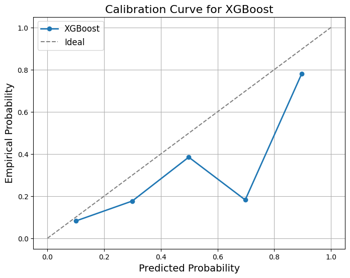
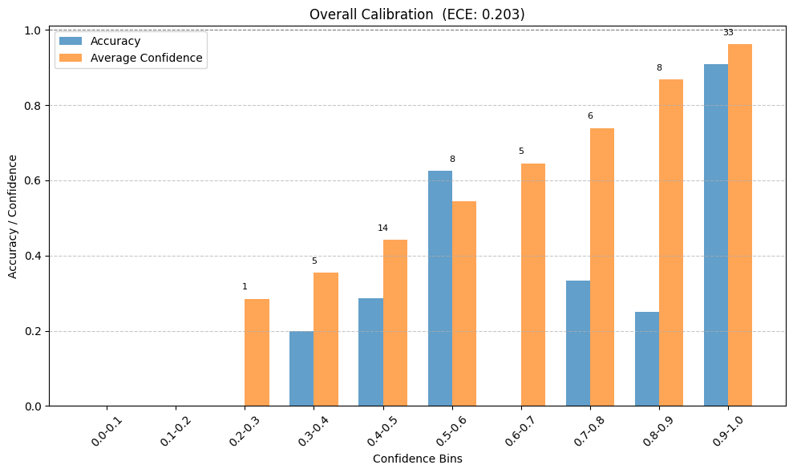
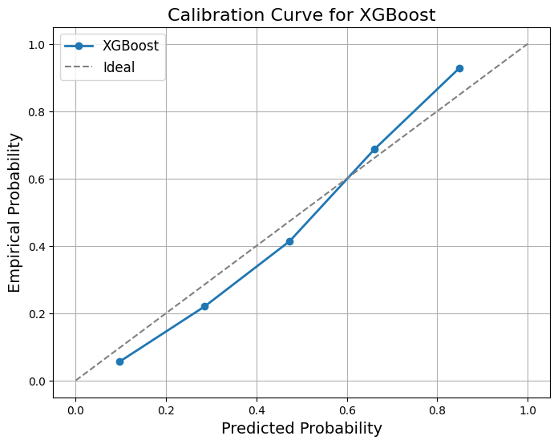
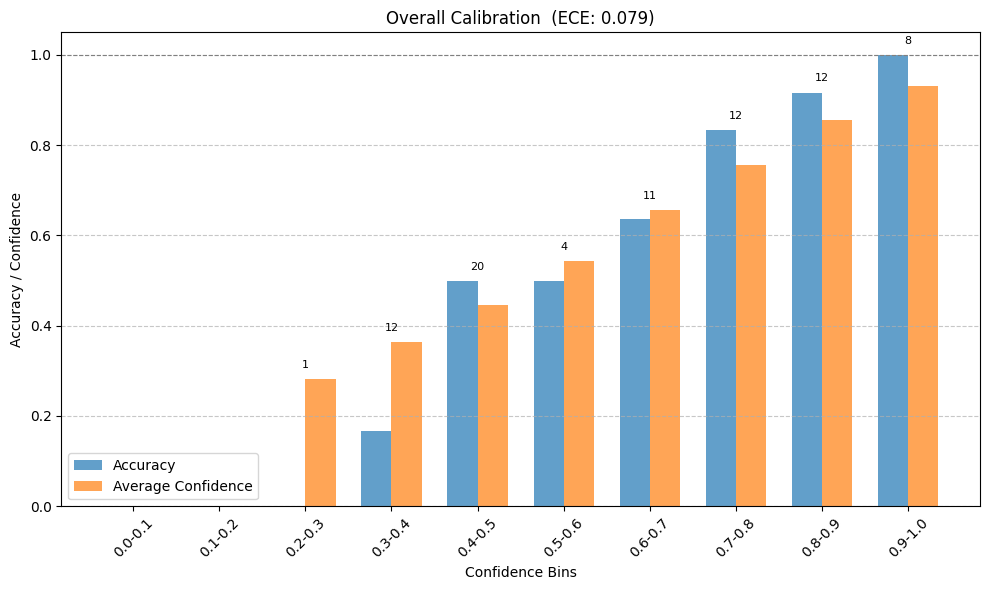

### **Calibration Task Report**

---

### **Objective**
The primary objective of this task was to develop a calibrated multi-class classification model for a small dataset. The aim was to ensure that the model produces reliable probability estimates while improving its generalization and overall performance. Calibration is crucial for scenarios requiring probabilistic predictions, as it ensures that the predicted probabilities reflect the true likelihood of an event.

---

### **Dataset Overview**
- **Size**: Small dataset with limited examples for each class.  
- **Classes**: The dataset contained multiple target classes with significant class imbalance.  
- **Features**: 57 features, including both numerical and categorical data.  
- **Challenges**:
  - Small sample size, leading to potential overfitting.
  - Class imbalance, causing bias toward majority classes.
  - Calibration issues, with the model initially being overconfident.

---

### **Model Overview**
The chosen model for this task was **XGBoost**, a tree-based algorithm that is highly effective for tabular data. XGBoost was used with the **multi:softprob** objective to predict class probabilities. The model's parameters were tuned to optimize its performance while maintaining calibration.

---

### **Techniques Applied**

#### **1. MixUp Data Augmentation**
- **What It Does**:  
  MixUp generates augmented examples by linearly combining two data points and their corresponding labels. This helps increase the diversity of the training set.
  
- **Reason for Use**:  
  The dataset was small and imbalanced, leading to overfitting. MixUp mitigated this issue by augmenting the dataset and forcing the model to generalize better.

- **Impact**:  
  - Increased the effective size of the dataset.
  - Reduced overfitting and improved the model's generalization.
  - Enhanced the calibration of predicted probabilities by making the training process more robust.

---

#### **2. Label Smoothing**
- **What It Does**:  
  Label smoothing modifies the hard 1-hot encoded labels to soft probabilities. For example, instead of `[1, 0, 0]`, it produces something like `[0.9, 0.05, 0.05]`. This discourages the model from becoming overly confident.

- **Reason for Use**:  
  The model was overconfident in its predictions, as shown by the high Expected Calibration Error (ECE). Label smoothing regularized the model's outputs by softening target labels.

- **Impact**:  
  - Improved the alignment of predicted probabilities with true outcomes.
  - Reduced overconfidence in predictions, as reflected by the decrease in ECE.

---

#### **3. Calibration Metrics and Visualization**
Calibration metrics and visualizations were used to evaluate the reliability of the predicted probabilities.  
- **Expected Calibration Error (ECE)**:  
  Measures the average difference between predicted confidence and actual accuracy.

- **Plots Used**:
  1. **Reliability Curve**: Showed the alignment of predicted probabilities with actual outcomes.
  2. **Overall Calibration Curve (Bar Chart)**: Provided a clear overview of accuracy and confidence across different probability bins.

---

### **Results**

#### **Before Calibration**
- **Accuracy**: 55%  
- **ECE**: 0.203  
- **Reliability Curve**: The model was overconfident, with predicted probabilities deviating significantly from the ideal diagonal.  
- **Bar Chart**: Showed a large gap between average confidence and accuracy in most bins, especially in high-confidence predictions.

---

#### **After Calibration**
1. **Techniques Applied**:  
   - MixUp (Repeat: 10, Alpha: 0.4).  
   - Label Smoothing (Smoothing Factor: 0.3).  

2. **Results**:
   - **Accuracy**: Improved to 62.5%.  
   - **ECE**: Reduced significantly to 0.079.  
   - **Reliability Curve**: Aligned closely with the ideal diagonal, indicating well-calibrated predictions.  
   - **Bar Chart**: Confidence and accuracy gaps were reduced across all bins, demonstrating better reliability of predicted probabilities.  

---

### **Key Visualizations**

#### **Before Calibration**
1. **Calibration Curve**:  
     
   - The curve deviated significantly from the ideal diagonal, showing overconfidence.

2. **Overall Calibration Bar Chart**:  
     
   - Large gaps between accuracy and confidence across all bins.

---

#### **After Calibration**
1. **Calibration Curve**:  
     
   - The curve aligned closely with the ideal diagonal.

2. **Overall Calibration Bar Chart**:  
     
   - Gaps between accuracy and confidence were minimized, particularly in high-confidence bins.

---

### **Conclusions**
1. **MixUp**:
   - Successfully mitigated overfitting by increasing data diversity.
   - Improved generalization, leading to better alignment of predicted probabilities.

2. **Label Smoothing**:
   - Reduced overconfidence in predictions.
   - Improved the model's ability to produce reliable probability estimates, as reflected by the decrease in ECE.

3. **Calibration**:
   - The model is now well-calibrated, with reliable probability estimates that are aligned with actual accuracy.  
   - The significant drop in ECE (from 0.203 to 0.079) demonstrates the effectiveness of the applied techniques.
